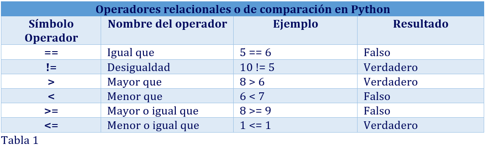
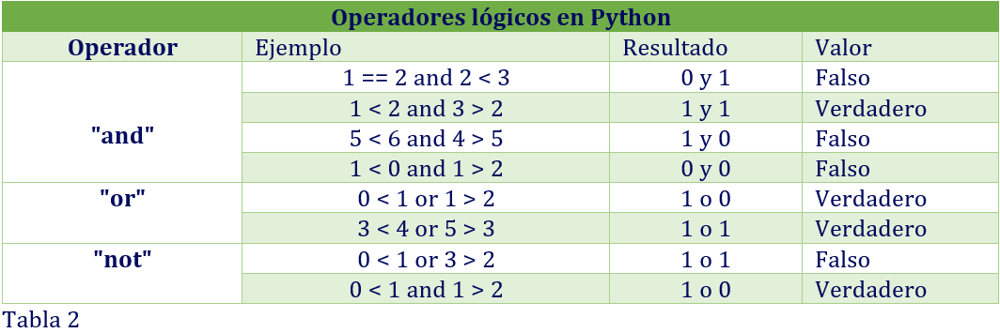

# EJERCICIO DE DOCUMENTACIÓN DE PYTHON CON LENGUAJE MARKDOWN
# 1. Condicionales y estructuras de control en Python


## ¿Qué es un condicional?

Las estructuras de control condicionales son aquellas que permiten evaluar si
una o más condiciones se cumplen, para decir qué acción se va a ejecutar.

Las condiciones se evalúan como **verdaderas** (`True`) o **falsas** (`False`), es decir: O la condición se cumple (la condición es **verdadera**), o la condición no se cumple (la condición es **falsa**).

Para poder evaluar si los condicionales cumplen con las validaciones requeridas, se puede hacer uso de dos tipos de operadores:


### <u> *1. Operadores relacionales o de comparación*: </u>
Utilizados comúnmente para poder hacer comparaciones entre datos:





### <u> *2. Operadores lógicos:* </u>
Nos permiten realizar más de una comparación relacional sobre los datos simultáneamente:



Como se puede observar en la tabla anterior de operadores lógicos, el resultado de cada operación se evalúa primero individualmente (*Resultado*: **1** -> indica un resultado **verdadero** de la condición, mientras que **0** indica un resultado **falso**), posteriormente se evalúa el resultado completo de todas las condicionales existentes.

#### **Descripción de resultados de los operadores lógicos:**

- **Operdaor AND**: 
Para el operador “**and**” el valor “**Verdadero**” únicamente aparecerá cuando el resultado de todas las condiciones existentes sea verdadero, es decir que cada condición individual debe tener como resultado **1** (**verdadero**), en caso contrario: si existe al menos una _sola condición_ (dentro de todas las condiciones existentes) cuyo resultado sea **0** (**falso**), el resultado final será “**Falso**”.

- **Operdaor OR**: 
Para el operador “**or**”, el valor “**Verdadero**” aparecerá cuando el resultado de cualquiera de las condiciones existentes sea verdadero, _es decir_: si tenemos 4 condicionales en total, y al menos una de estas condiciones tiene como resultado **1** (**verdadero**), entonces el resultado final será “**Verdadero**”, el operador “**or**” solamente tendrá valor final “**Falso**” cuando todas sus condiciones sean **0** (**falso**).
- **Operdaor NOT**: 
El operador “**not**”, nos indica que el resultado final va a tener un valor opuesto al resultado de la condición, _es decir_: si el resultado final de la condición es “**Falso**”, el operador “**not**” nos va a convertir el resultado a “**Verdadero**” y viceversa.

Gracias a los condicionales, podemos tomar decisiones de manera lógica y correcta, estos condicionales hacen parte de nuestra vida cotidiana, un _ejemplo_ muy sencillo sobre un condicional para la toma de decisiones podría ser:

## _Ejemplo_: 

>**Si** la iglesia está abierta, entrar a la iglesia. **Sino**, esperar a que la iglesia abra para entrar.

En ocasiones, se evalúa más de una condición para llegar a ejecutar la misma
acción:

>**Si** la iglesia está abierta **o** la están abriendo, entrar a la iglesia.
**Sino**, esperar a que abran la iglesia.

## Tipos de condicionales en Python

Los principales condicionales en Python son:

- ### if:
```python
precio = 31
if precio > 30:
    print("El precio es caro")
```

**Explicación**:

**if**: ejecuta el código al que va asociado _si_ la condición es **verdadera**. En el ejemplo, sería mostrar el mensaje “**El precio es caro**” _si_ el precio del producto es **mayor** a 30.


- ### else:
```python
precio = 11
if precio <= 10:
    print("El precio es barato")
else:
    print("El precio es caro")
```
**Explicación**:

**else**: va después de un **if**. Aplica el código al que está conectado _si_ la condición que el **if** marca es **falsa**. Es decir, _si_ **A** no se cumple, else **B**.


- ### elif
```python
precio = 25
if precio <= 10:
    print("El precio es barato")
elif precio >= 11 and precio < 30:
    print("El precio es el adecuado")
else:
    print("El precio es caro")
```
**Explicación**:

**elif**: si hay varias condiciones que comprobar antes de “**decidir**”, se utiliza **if** en la primera y **elif** en las siguientes. En el ejemplo se expresa que, _si_ el precio no es _menor_ o _igual_ que 10, **sino** que el precio es _mayor_ o _igual_ a 11 y _menor_ a 30, entonces mostrará el mensaje “**El precio es el adecuado**”.

## Condicionales anidados y operadores lógicos en Python

Los **condicionales anidados** en Python son el resultado de introducir un condicional dentro de otro.
Un _ejemplo_ de esto podría ser:


```python
clima = 26
if clima > 20:
    if clima < 30:
        print("El clima está entre 20 y 30")
    else:
        print("El clima es mayor que 30")
else:
    print("El clima es menor o igual a 20")
```
También podemos hacer _condicionales_ mediante el uso de _operadores lógicos_, vamos a ver un ejemplo con el operador “**or**”:

```python
clima = 27 
if clima > 20 or clima > 26: 
    if clima < 26: 
        print("El clima está entre 20 y 26.") 
    else: 
        print("El clima es mayor que 26.") 
else: 
    print("El clima es menor o igual a 20.") 
```

>## Prácticas recomendadas y errores comunes en el uso de condicionales:

Para usar correctamente los condicionales en Python hay que seguir las buenas prácticas que recomiendan los/as desarrolladores/as. Estas son:

1. Explicar los condicionales más complejos con comentarios, para que otros/as programadores/as puedan comprenderlo.

2. Colocar las condiciones en la secuencia correcta, sobre todo si se usan sentencias como el **elif**, que valora los requisitos según el orden en el que se hayan escrito.

3. Optar siempre por la opción más sencilla. _Por ejemplo_, usar el **and** cuando se pueda, en lugar de varios **if** anidados.

4. Recurrir a los _paréntesis_ cuando se combinan distintos _condicionales y operadores_.

Algunos de los errores más comunes al usar los condicionales en Python suelen ser los siguientes:

1. No escribir los dos puntos “**:**” después de los condicionales.

2. Abusar de las anidaciones, que hacen que el código sea cada vez más complejo y que el software esté menos optimizado.

3. No contemplar todos los requisitos posibles.

4. Realizar una _indentación_ incorrecta o confundir los _operadores_.  
  

# 2. ¿Qué son los Bucles en Python y cuál es su utilidad?

Lo primero que debemos mencionar, es que un _bucle_ nos permite alterar el flujo normal de un programa, dicho de otra forma: _nos da la posibilidad de ejecutar una parte del código repetitivamente las veces que nosotros queramos y de esta manera ahorramos tiempo y evitamos escribir el mismo código muchas veces_.

Phyton solamente maneja dos tipos de _bucles_ y estos son:

1. Los bucles **for** : Cuando se sabe de antemano cuántas veces se va a repetir el programa.
2. Los bucles **While** : Cuando no se conoce de antemano el número de repeticiones del programa.


### 1. Bucle **while**

La palabra reservada **while** que en español significa “**mientras**” ejecuta una acción una y otra vez hasta que la condición especificada sea **falsa**; o, dicho de otro modo, _ejecuta una acción mientras que la condición sea **verdadera**_.

Generalmente la condición que se aplica en un _bucle_, depende de una variable definida previamente que se actualizará al pasar por el bucle, si dicha variable que representa el valor de la condición nunca cambia, esto hará que el bucle se repita infinitamente.


```python
a = 1
while a < 10:
    print("¡Hola, mundo!")
```
Si ejecutamos el código anterior, veremos que el programa imprime infinitamente el mensaje en pantalla. Esto ocurre porque la condición ```a < 10``` es siempre **verdadera** (uno es menor que diez) y el valor de “**a**” nunca cambia.

Ahora bien, consideremos este otro _ejemplo_.
```python
a = 1
while a < 10:
    print("¡Hola, mundo!")
    a += 1
```
Ahora el resultado es distinto: el mensaje se imprime nueve veces, esto pasa porque cuando el intérprete tiene que ejecutar el _bucle_, evalúa la condición ```a < 10```, que en un primer momento equivale a: ```1 < 10```, que es **verdadero**. Entonces, ejecuta el bloque de código dentro del _bucle_: imprime el mensaje en pantalla y luego le suma **1** a la variable **a**. Cuando el bloque de código finaliza, se vuelve a evaluar la condición, que ahora resulta ser ```2 < 10```, aún **verdadero**. Luego se ejecuta nuevamente el bloque de código y el proceso se repite hasta llegar a la condición ```10 < 10```, que es **falsa** y el _bucle_ termina.

### 2. Bucle **for**

El _bucle_ for de Python, es aquél que facilita la iteración sobre los elementos de una _tupla_ o _lista_. El _bucle_ **for** siempre se utilizará sobre una _lista_ o _tupla_, de tal forma que en cada iteración, se puedan ejecutar las misma acciones sobre cada uno de los elementos.

Un _ejemplo_ de esto lo podemos ver a continuación:

```python
lenguajes = ["Python", "C", "C++", "Java"]
for lenguaje in lenguajes:
    print(lenguaje)
```
Lo que ha ocurrido aquí es lo siguiente: el _bucle_ **for** ejecuta el bloque de código _indentado_ (en este caso la llamada a ```print()```) tantas veces como elementos haya en la colección indicada a la derecha del operador **in**. Pero, cada vez que ese código es ejecutado, la variable _lenguaje_ tendrá un valor diferente: en la primera ejecución será igual a "**Python**"; en la segunda, a "**C**"; y así hasta alcanzar el final de la lista.

También debemos tener en cuenta que los bucles pueden hacer uso de condicionales, que pueden ayudar a determinar el flujo del código y nos pueden ayudar con la actualización de las variables que puedan influir en la toma de decisiones de los _bucles_ y con esto determina si se termina el _bucle_ o si continua.

Dentro de los bucles también existe una instrucción que; así como lo vimos en los condicionales, nos ayudan en la toma de decisiones, esta instrucción es:

### Instrucción break
```python
i = 0
while i < 10:
    i += 1
    print("Bonjour")
    if i > 6:
        break
```
En este ejemplo, mientras la variable sobre la que se establece nuestra condición sea menor o igual que 6, el bloque de instrucciones continúa ejecutándose. Cuando la condición del bloque de instrucciones, sea menor o igual a 6, salimos del bucle con la palabra “**break**”.

### ¿Cuando usar el bucle while y cuando usar el bucle for?
Si conocemos el número de iteraciones que queremos realizar entonces se recomienda utilizar un _bucle_ **for**. Mientras que si no conocemos con exactitud cuantas iteraciones queremos realizar, podemos emplear el _bucle_ **while**.

Debemos tener mucho cuidado cuando estemos iterando el _bucle_ **while**, porque podemos caer en el error de tener un **bucle infinito**, por lo que se recomienda definir el punto de detención al que se le conoce como “**valor centinela**” o valor de "**parada**", el cual nos indica cuando debe terminar la ejecución del _bucle_. Una vez que la condición del **while** evalúa como “**falso**” porque el “**valor centinela**” ha sido encontrado, el _bucle_ se detiene y el programa continúa con la siguiente ejecución.

También debemos tener en cuenta, que es posible realizar las mismas operaciones de un _bucle_ **for** utilizando un _bucle_ **while**. Por tanto, cualquier _bucle_ **for** puede escribirse como un _bucle_ **while**. Lo contrario es incorrecto.

He aquí un _ejemplo_ de _bucle_ **for**:

```python
for i in range(10) : 
	print(i**2)
```

Con su equivalente en **while**:

```python
i = 0 
while i<10 : 
	print(i**2)
	i = i+1
```


# 3. Listas por comprensión en Python

La comprensión de listas en Python significa que podemos configurar varios _bucles_ **for** – in para que funcionen en una sola línea de código y generar una lista a partir de esa línea.

Para que podamos comprender un poco mejor el significado de la _comprensión de listas_ vamos ver el siguiente _ejemplo_ de cómo se podría crear una lista de la forma tradicional “utilizando un bucle” y cómo podríamos realizar la misma acción utilizando las listas por comprensión.

**_Ejemplo_ de creación de lista con bucle de forma tradicional**:

```python
lista1 = [2, 4, 6, 8, 10]
lista2 = []
for elemento in lista1:
    lista2.append(elemento * elemento)
print(lista2)
```

**_Ejemplo_ de creación mediante las listas de comprensión**:

```python
Lista1 = [2,4,6,8,10]
Lista2 = [elemento * elemento for elemento in lista1]
print(lista2)
```
En el ejemplo anterior tenemos el mismo comportamiento que la forma _tradicional_, pero con la diferencia que hemos eliminado **2** _líneas de código_ y el _bucle_ se encuentra ahora en una _sola línea_.

En las buenas prácticas, debemos tener cuidado siempre con la _indentacion_ en Python y con la _sintáxis_ que se utilice, ya que puede ser muy simple y puede resultar algo confusa para los principiantes.


# 4. Argumentos en Python

Un **argumento** en Python, lo podemos describir como el valor que se pasa a una función (o método) cuando se realiza un llamado a dicha función.

Un _ejemplo_ sencillo de un argumento es:
```python
def saludo(nombre):
    print(f'Hola {nombre}')
saludo('Erik')
```
En el ejemplo anterior, vemos que existe una _función definida_ que recibe un **argumento** “_name_” y la función imprime _Hola + el valor_ que tiene el argumento “**name**” y como resultado podríamos ver ```“Hola Erik”```.

En Python existe la posibilidad de agregar un _valor por defecto_ a un **argumento**, para que cuando la función sea llamada sin ningún tipo de *argumento*, dicha función será capaz de tomar el _valor por defecto_ e imprimirlo.

## _Ejemplo_:

```python
def saludo(nombre='Humano'):
    print(f'Hola {nombre}')
saludo()
```
En el ejemplo anterior, podemos observar que el **argumento** “_name_” tiene por defecto el valor “_Humano_” y cuando se llama a la función no se le está enviando ningún argumento, por lo tanto, el resultado sería: ```“Hola Humano”```

En Python existen dos tipos de argumentos:

**1. Argumentos posicionales**: significa que la asignación entre el valor y como se utiliza dicho valor en la función, está completamente determinado por la posición y el orden en el que se pasan los valores.

## _Ejemplo_:
```python
def nombre_completo(first, last):
    print(f'{first} {last}')
nombre_completo(‘Erica’,’Espinosa’)
```
Para el _ejemplo_ anterior, ```‘Erica’``` pasaría como el primer argumento ```“first”``` y ```‘Espinosa’``` pasaría como el segundo argumento ```“last”```.

Una buena práctica para el uso de este tipo de argumentos, es que suele utilizarse cuando definimos funciones que no tienen un número elevado de argumentos, esto nos ayuda a tener un orden claro y coherente en la definición y llamada a las funciones.

**2. Argumentos nombrados**: dan la posibilidad de ser mas explícitos con este mapeo, es decir que se llaman con el nombre que se definieron.

## _Ejemplo_:
```python
def nombre_completo(first, last):
    print(f'{first} {last}')
nombre_completo(last='Espinosa', first='Erica')
```
Para el ejemplo anterior, cuando estamos llamando a la _función definida_, le estamos diciendo que para el argumento ```“last”``` le queremos dar el valor de ```‘Espinosa’``` y para el argumento ```“first”``` le queremos dar el valor de ```‘Erica’```, por lo tanto, para este caso, no importa si le cambiamos la posición de los argumentos porque le estamos diciendo explícitamente el valor que queremos dar a cada argumento que se definió en la función.

En las buenas prácticas, cuando son más de dos argumentos se recomienda llamarlos con _nombre_, esto evita que se cometan errores en el envió de los valores.

# 5. Funciones Lambda en Python

Es una herramienta que permite _encapsular una función_. Normalmente una función mas pequeña y luego pasarla fácilmente a otras funciones, se puede considerar que un **lambda** es casi similar a una variable, que se puede pasar en lugar de valores básicos como una cadena, un diccionario o algo similar.

**Lambda** permite empaquetar un proceso, de otro modo podemos decir que **lambda** es una versión acortada de una función.

Para poder entender un poco mejor cual sería la diferencia entre una _función normal_ y una _función lambda_ vamos a ver lo siguiente.

## _Ejemplo de definición de una función tradicional_:
```python
def suma(a, b):
    return a+b

resultado = suma(2+4)
print(resultado)
```
## _Ejemplo de definición de una función lambda_:
```python
suma = lambda a, b: a + b
print(suma(2, 4))
```

En este _ejemplo_ anterior podemos ver que la _función lambda_ es una versión corta de una _función tradicional_ que suma 2 números.

Cuando estamos construyendo una _función lambda_, debemos tener en cuenta que dichas funciones no tienen un nombre especifico y por lo tanto serían prácticamente inútiles a menos que sean asignadas a una _variable_, para el ejemplo anterior vemos que la _función lambda_ ha sido asignada a la variable ```“suma”```.

Una vez que tenemos la _función lambda_, podemos hacer el llamado como una función tradicional, ejemplo: 
```python
suma(2,4)
```
Una buena practica para estas _funciones lambda_, es que se usen para crear funciones simples, rápidas y temporales. Deben ser concisas y fáciles de entender, si la lógica se vuelve compleja es mejor definir una _función tradicional_.

# 6. Paquete PIP en Python

El **pip** es un "_sistema de gestión de paquetes para Python_", su nombre significa “**Pip Installs Packages**” lo que en español quiere decir: “**Pip Instala Paquetes**”

Con **pip**, podemos instalar, actualizar y desinstalar paquetes de Python de manera sencilla.

Los paquetes que se pueden instalar con **pip**, son colecciones de módulos y funcionalidades que pueden ser creados, distribuidos y también utilizados por otros programadores y normalmente son módulos que no se encuentran dentro del paquete de funcionalidades del propio Python.

Un ejemplo básico de como instalar un paquete con **pip** es el siguiente

```python
pip install requests
```
Si necesitas una guía detallada para instalar pip, puedes remitirte al siguiente enlace: [enlace en línea](https://pip.pypa.io/en/stable/installation/)


# 7. Enlaces sugeridos

### Información sobre lenguaje MarkDown
https://markdown.es/sintaxis-markdown/
### Tutorial Aprende rápido MarkDown
https://www.youtube.com/watch?v=y6XdzBNC0_0&ab_channel=JavierCristobalGutierrez

### Documentación Python
https://tutorial.recursospython.com/bucles/

https://datascientest.com/es/while-las-bucles-en-python#:~:text=En%20Python%2C%20los%20bucles%20se,n%C3%BAmero%20de%20repeticiones%20del%20programa

https://www.tokioschool.com/noticias/condicionales-python/
#### Libro en linea de lenguaje Python
https://www.researchgate.net/publication/333965199_Introduccion_al_Lenguaje_Python